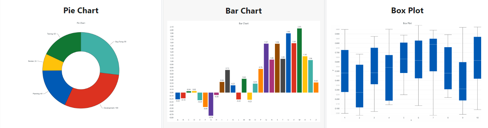

## Gold Price Prediction Analysis with LightningChart Python

### 1. Introduction

#### 1.1 What Are Price Predictions and Forecasts?

Price predictions and forecasts are crucial elements in the financial market, providing insights and guidance for investors. They help manage risk and inform decision-making by projecting future price movements based on historical data and market indicators. Predicting gold prices, in particular, is of significant interest due to gold's role as a safe-haven asset and its influence on the global economy.

#### 1.2 Factors That Affect the Price of Gold

The price of gold is influenced by various factors, including economic data, geopolitical events, and market sentiment. Key factors include:
• Inflation Rates: Higher inflation often leads to higher gold prices as investors seek to preserve value.
• Currency Strength: A weaker U.S. dollar generally boosts gold prices since gold is priced in USD.
• Geopolitical Stability: Uncertainty or conflict can drive investors to gold.
• Supply and Demand Dynamics: Gold production levels and demand for jewelry and industrial use affect prices.

#### 1.3 Central Bank Decisions and Interest Rates

Central banks play a significant role in gold market prediction. Their decisions on interest rates and monetary policy directly impact gold prices. For instance, lower interest rates reduce the opportunity cost of holding gold, often leading to price increases.

#### 1.4 Gold Characteristics and Utility

Gold's unique characteristics, such as its durability, malleability, and conductivity, contribute to its utility in various industries, including electronics and jewelry. These factors, combined with its historical value as a form of currency and store of wealth, make it a critical asset in the global financial system.

### 2. LightningChart Python

#### 2.1 Overview of LightningChart Python

LightningChart is a high-performance data visualization library that provides a wide range of chart types and features, ideal for visualizing complex data sets like those used in stock market sentiment analysis. Its Python version allows developers to create interactive, high-performance visualizations with ease.

#### 2.2 Features and Chart Types to be Used in the Project

LightningChart Python offers a variety of chart types, each designed to handle specific types of data visualization needs. In this project, we use the following chart types to visualize stock price prediction data:

- **XY Chart**: For visualizing data in two dimensions with series types such as Line Series, Point Line Series, and Area Series.
- **Line Series**: Ideal for displaying continuous data points connected by straight lines, useful for showing trends over time.
- **Bar Chart**: Used for visualizing categorical data as bars, making it easy to compare different categories side by side.
- **Grouped Bar Chart**: Similar to the bar chart, but groups bars together based on additional categories, facilitating comparison within groups.
- **Stacked Bar Chart**: Allows for visualizing the composition of each category, showing how individual parts contribute to the whole.
- **Area Chart**: Fills the area beneath a line series, useful for emphasizing volume or cumulative values.



#### 2.3 Performance Characteristics

LightningChart handling millions of data points with ease and maintaining smooth user interactions. One of the standout aspects of LightningChart Python is its performance. The library is optimized for handling large volumes of data with minimal latency, which is crucial for financial applications where data needs to be processed and visualized in real-time to inform trading decisions.

### 3. Setting Up Python Environment

#### 3.1 Installing Python and Necessary Libraries

Install Python from the [official website](https://www.python.org/downloads/) and use pip to install necessary libraries including LightningChart Python from PyPI. To get the [documentation](https://lightningchart.com/python-charts/docs/) and the [license](https://lightningchart.com/python-charts/), please visit [LightningChart Website](https://lightningchart.com/).

```python
pip install lightningcharts random numpy pandas scikit-learn tensorflow
```

```python
import lightningchart as lc
import random

lc.set_license('my-license-key')

import numpy as np
import pandas as pd
import time

from sklearn.preprocessing import MinMaxScaler
from sklearn.model_selection import train_test_split
from sklearn.metrics import mean_absolute_percentage_error
import tensorflow as tf
from keras import Model
from keras.layers import Input, Dense, Dropout
from keras.layers import LSTM
```

#### 3.2 Overview of Libraries Used

- **LightningChart**: Advanced data visualization.
- **NumPy**: Numerical computation.
- **Pandas**: Data manipulation and analysis.
- **Scikit-learn**: Data mining and data analysis.
- **Tensorflow**: Machine learning model development.


#### 3.3 Setting Up Your Development Environment

Recommended IDEs include Jupyter Notebook, PyCharm, or Visual Studio Code.

### 4. Loading and Processing Data

#### 4.1 How to Load the Data Files

Data can be loaded from CSV or other file formats using Pandas:

```python
import pandas as pd

# Load the CSV file
df = pd.read_csv('./gold_data.csv')
```

#### 4.2 Handling and preprocessing the data

Preprocessing steps may include handling missing values, normalizing data, and feature engineering.

```python
# Dropping 'Vol.' and 'Change %'
df.drop(['Vol.', 'Change %'], axis=1, inplace=True)

# Transforming the data in the data frame
df['Date'] = pd.to_datetime(df['Date'])
df.sort_values(by='Date', ascending=True, inplace=True)
df.reset_index(drop=True, inplace=True)

# Removing the “,” sign
NumCols = df.columns.drop(['Date'])
df[NumCols] = df[NumCols].replace({',': ''}, regex=True)
df[NumCols] = df[NumCols].astype('float64')

# Checking Duplicates and Missing Values
df.duplicated().sum()
df.isnull().sum().sum()
```

#### 4.3 Validation of the Study

By employing an LSTM (Long Short-Term Memory) model, we successfully forecasted the adjusted closing price of gold ETFs. The predictive model's performance was validated using the MAPE (Mean Absolute Percentage Error) metric, yielding the following results:
  •	Test Loss: 0.0011
  •	Test MAPE: 0.0379
  •	Test Accuracy: 0.96

These findings indicate that the LSTM model is highly effective, achieving a low test loss and a MAPE of approximately 3.79%. The model's test accuracy of 96.21% highlights its robustness and reliability in predicting gold prices. Utilizing LightningChart for data visualization further enhanced our analysis, providing clear and interactive visual representations of the forecasted data.

### 5. Visualizing Data with LightningChart

#### 5.1 Introduction to LightningChart for Python

LightningChart Python allows for the creation of highly interactive and customizable charts. Here are some of the LC charts below:


#### 5.2 Creating the charts

To visualize the data, you can create various charts using LightningChart Python:

```python
import lightningchart as lc
import random

# Initialize LightningChart and set the license key
lc.set_license('my-license-key')

# Creating a chart using LightningChart
chart = lc.ChartXY(title= 'Gold Price History Data')
```

#### 5.3 Customizing visualizations

LightningChart offers extensive customization options. You can change the theme and colors, add markers, hide or sort some features or integrate real-time data updates to enhance the visualization:

```python
# Initialize the chart
chart = lc.ChartXY(
theme=lc.Themes.CyberSpace,
title='Gold Price History Data'
)

# Adding and configuring the x-axis for datetime display
x_axis = chart.get_default_x_axis()
x_axis.set_tick_strategy('DateTime', time_origin=time_origin)

# Adding a line series
series = chart.add_line_series()
series.add(x=x_values, y=y_values)

# Customizing axes titles
x_axis.set_title('Date')
chart.get_default_y_axis().set_title('Scaled Price')

# Opening the chart
chart.open()
```

### 6. Conclusion

#### 6.1 Findings

Through this project, we demonstrated how to predict gold prices using Python and visualize the data with LightningChart. Using an LSTM model, we accurately predicted the adjusted closing price of gold ETFs. The test accuracy of 96% confirms the model's robustness. LightningChart provided effective visualization, enhancing our analysis with clear, interactive charts.

#### 6.2 Benefits of using LightningChart Python for visualizing data

LightningChart Python offers robust performance, making it ideal for financial data analysis. Its extensive customization options and high rendering efficiency enable detailed and interactive visualizations, enhancing the overall analysis process.